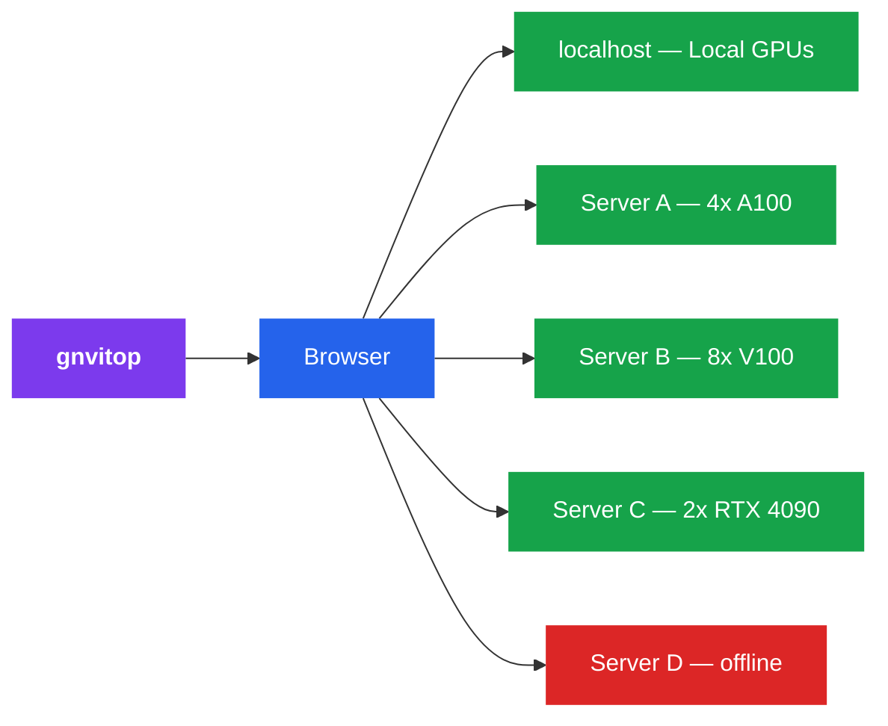

<p align="center">
  
</p>

<h1 align="center">gnvitop</h1>

<p align="center">
  <strong>Global nvitop</strong> — a web-based GPU monitoring dashboard that monitors <strong>all</strong> your remote GPU servers from a single page.
</p>

<p align="center">
  <a href="https://pypi.org/project/gnvitop/"></a>
  <a href="https://pypi.org/project/gnvitop/"></a>
  <a href="https://github.com/Linwei94/gnvitop/blob/main/LICENSE"></a>
</p>


Like [nvitop](https://github.com/XuehaiPan/nvitop), but for **all your servers at once**, displayed as a beautiful web dashboard.

```
pip install gnvitop
gnvitop
```

## How It Works

1. Monitors **local GPU** automatically (no config needed)
2. Reads your `~/.ssh/config` and SSH into each remote server
3. Runs `nvidia-smi` to collect GPU stats and **per-GPU process/user info**
4. Displays everything in a real-time web dashboard with **current user highlight**
5. Auto-refreshes every 30 seconds



## Installation

```bash
pip install gnvitop
```

## Usage

```bash
gnvitop                              # start and auto-open browser
gnvitop -p 8080                      # custom port
gnvitop --host 0.0.0.0              # expose to LAN
gnvitop --no-browser                 # don't auto-open browser
gnvitop --ssh-config /path/to/config # custom SSH config
gnvitop --tui                        # terminal UI mode (no browser)
gnvitop --tui --tui-refresh 10       # TUI with 10s refresh interval
gnvitop -v                           # show version
```

Or run as a module:

```bash
python -m gnvitop
```

## Prerequisites

1. **SSH config** -- your `~/.ssh/config` should have server entries:

```
Host gpu-server-01
    HostName 192.168.1.101
    User alice
    IdentityFile ~/.ssh/id_rsa

Host gpu-server-02
    HostName 192.168.1.102
    User bob

# ProxyJump (bastion/jump host) is fully supported
Host compute-node
    HostName compute-node.internal
    User alice
    ProxyJump bastion-host
```

2. **SSH key auth** -- password-less login should be set up
3. **nvidia-smi** -- must be installed on the remote servers

## Features

- **Zero config** -- reads `~/.ssh/config` automatically, no setup needed
- **One command** -- `pip install gnvitop && gnvitop`, that's it
- **Local + Remote** -- monitors local GPU alongside all remote servers
- **ProxyJump support** -- monitors compute nodes behind bastion/jump hosts (reads `ProxyJump` from SSH config)
- **Per-GPU users** -- shows which users occupy each GPU and their memory usage
- **User highlight** -- your own processes are highlighted in blue for quick identification
- **TUI mode** -- `gnvitop --tui` for a terminal UI (like nvitop) without a browser
- **Auto browser** -- opens dashboard in your browser on start
- **Adjustable refresh** -- choose 5s / 10s / 30s / 5min auto-refresh interval
- **Concurrent** -- queries all servers in parallel (20 workers)
- **Fast loading** -- background cache warming so the dashboard loads instantly; SSE streaming shows each server as it responds
- **Collapse cards** -- fold individual server cards to a compact strip, moved to a separate Folded section
- **Drag to reorder** -- drag server cards to arrange them in any order, persisted across reloads
- **Compact / Normal modes** -- toggle between full detail and compact views
- **Dark UI** -- clean, responsive dark-themed dashboard
- **At a glance** -- summary bar shows online hosts, total GPUs, idle GPUs, free memory
- **Color coded** -- green (online), yellow (no GPU), red (offline), blue (local)
- **GPU details** -- utilization bars, memory bars, temperature with color alerts

## Comparison with nvitop

| Feature | nvitop | gnvitop |
|---------|--------|---------|
| Monitor local GPU | Yes | Yes |
| Monitor remote GPUs | No | Yes |
| Multiple servers | No | Yes |
| Show per-GPU users | Yes | Yes |
| Highlight current user | No | Yes |
| Interface | Terminal | Web browser + Terminal (TUI) |
| Setup | Run on each server | Run once, reads SSH config |

**gnvitop** is not a replacement for nvitop -- it's a complement. Use nvitop for detailed local process-level GPU monitoring, use gnvitop to get an overview of all your GPU servers (including local) from one place.

## License

MIT
