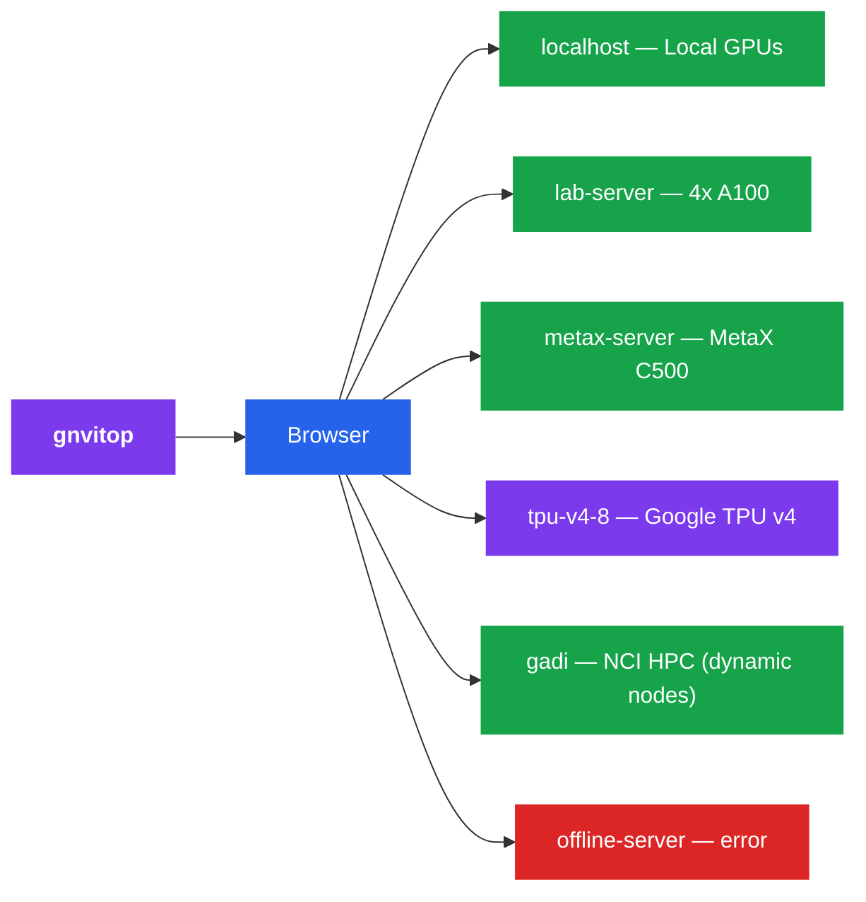

<p align="center">
  
</p>

<h1 align="center">gnvitop</h1>

<p align="center">
  <strong>Global nvitop</strong> — a web-based GPU &amp; TPU monitoring dashboard that monitors <strong>all</strong> your remote accelerator servers from a single page.
</p>

<p align="center">
  <a href="https://github.com/cangjun123/gnvitop"></a>
  <a href="https://github.com/cangjun123/gnvitop"></a>
</p>


Like [nvitop](https://github.com/XuehaiPan/nvitop), but for **all your servers at once** — NVIDIA GPUs, MetaX GPUs, Google Cloud TPUs, and Gadi NCI compute nodes, displayed as a beautiful web dashboard.

```
git clone git@github.com:cangjun123/gnvitop.git
cd gnvitop
pip install -e .
gnvitop
```

## How It Works

1. Monitors **local GPU/TPU** automatically (no config needed)
2. Reads your `~/.ssh/config` and SSH into each remote server
3. Auto-detects accelerator type: runs `nvidia-smi` (NVIDIA), `mx-smi` (MetaX), or checks `/dev/accel*` (Google TPU)
4. Displays everything in a real-time web dashboard with **per-user process highlighting**
5. Auto-refreshes every 30 seconds; SSE streaming shows each server as it responds



## Installation

Use this fork directly. Do not install the published PyPI package if you want the customized dashboard and server settings in this repository.

```bash
git clone git@github.com:cangjun123/gnvitop.git
cd gnvitop
pip install -e .
```

If you do not use GitHub SSH keys, clone over HTTPS instead:

```bash
git clone https://github.com/cangjun123/gnvitop.git
cd gnvitop
pip install -e .
```

## Usage

```bash
gnvitop                              # start and auto-open browser
gnvitop -p 8080                      # custom port
gnvitop --host 0.0.0.0               # expose to LAN
gnvitop --no-browser                 # don't auto-open browser
gnvitop --ssh-config /path/to/config # custom SSH config
gnvitop --tui                        # terminal UI mode (no browser)
gnvitop --tui --tui-refresh 10       # TUI with 10s refresh interval
gnvitop --agent                      # output JSON for scripting/agents
gnvitop --history --csv out.csv      # record GPU history to CSV
gnvitop -v                           # show version
```

Or run as a module:

```bash
python -m gnvitop
```

## Prerequisites

1. **SSH config** — your `~/.ssh/config` should have server entries:

```
Host gpu-server-01
    HostName 192.168.1.101
    User alice
    IdentityFile ~/.ssh/id_rsa

Host gpu-server-02
    HostName 192.168.1.102
    User bob

# ProxyJump (bastion/jump host) is fully supported
Host compute-node
    HostName compute-node.internal
    User alice
    ProxyJump bastion-host

# Google Cloud TPU VM
Host tpu-v4-8
    HostName <external-ip>
    User <your-user>
    IdentityFile ~/.ssh/google_compute_engine
```

2. **SSH key auth** — password-less login should be set up
3. **Accelerator tools** — `nvidia-smi` (NVIDIA), `mx-smi` (MetaX), or `/dev/accel*` (TPU) on the remote servers

## Features

- **Zero config** — reads `~/.ssh/config` automatically, no setup needed
- **Fork-first install** — clone `cangjun123/gnvitop` and run `pip install -e .` to use this customized version
- **Local + Remote** — monitors local accelerator alongside all remote servers
- **Multi-vendor** — supports NVIDIA GPUs (`nvidia-smi`), MetaX GPUs (`mx-smi`), and Google Cloud TPUs
- **Non-bash shell safe** — wraps remote commands in `bash -c` so it works even if the remote login shell is fish, zsh, etc.
- **TPU support** — detects Google Cloud TPU chips via `/dev/accel*`, shows chip count and HBM spec (v4: 32 GB/chip); utilization shown as N/A until `torch_xla` is installed
- **MetaX support** — parses `mx-smi` output for MetaX C500 and compatible GPUs
- **Gadi NCI support** — SSHes into Gadi login nodes and auto-discovers allocated GPU compute nodes via `qstat`
- **ProxyJump support** — monitors compute nodes behind bastion/jump hosts
- **Per-GPU users** — shows which users occupy each GPU and their memory usage
- **User highlight** — your own processes are highlighted in blue for quick identification
- **Agent mode** — `gnvitop --agent` outputs structured JSON for use in scripts and AI agents
- **History recording** — `gnvitop --history` records GPU stats to CSV for trend analysis
- **TUI mode** — `gnvitop --tui` for a terminal UI without a browser
- **Auto browser** — opens dashboard in your browser on start
- **Adjustable refresh** — choose 5s / 10s / 30s / 5min auto-refresh interval
- **Concurrent** — queries all servers in parallel (20 workers)
- **Fast loading** — background cache warming so the dashboard loads instantly
- **Collapse cards** — fold individual server cards to a compact strip
- **Drag to reorder** — drag server cards to arrange them in any order, persisted across reloads
- **Compact / Normal modes** — toggle between full detail and compact views
- **Dark UI** — clean, responsive dark-themed dashboard
- **At a glance** — summary bar shows online hosts, total GPUs, idle GPUs, free memory
- **Color coded** — green (online), purple (TPU), yellow (no GPU), red (offline), blue (local)

## Agent Mode

`gnvitop --agent` outputs a JSON array suitable for scripting or AI agent use:

```bash
gnvitop --agent
```

```json
[
  {
    "host": "gpu-server-01",
    "status": "ok",
    "gpus": [
      {
        "index": 0,
        "name": "NVIDIA A100-SXM4-80GB",
        "memory_total_mb": 81920,
        "memory_used_mb": 1200,
        "memory_free_mb": 80720,
        "gpu_utilization_pct": 3.0,
        "available": true
      }
    ]
  },
  {
    "host": "tpu-v4-8",
    "status": "ok",
    "gpus": [
      {
        "index": 0,
        "name": "Google TPU v4",
        "memory_total_mb": 32768,
        "memory_used_mb": -1,
        "memory_free_mb": -1,
        "gpu_utilization_pct": -1,
        "available": true
      }
    ]
  }
]
```

For TPU chips, `memory_used_mb` and `gpu_utilization_pct` are `-1` (unknown) until `torch_xla` is installed on the TPU VM. `available` is `true` when no Python processes are detected.

## Comparison with nvitop

| Feature | nvitop | gnvitop |
|---------|--------|---------|
| Monitor local GPU | Yes | Yes |
| Monitor remote GPUs | No | Yes |
| Multiple servers | No | Yes |
| NVIDIA GPU support | Yes | Yes |
| MetaX GPU support | No | Yes |
| Google Cloud TPU support | No | Yes |
| Gadi NCI node discovery | No | Yes |
| Show per-GPU users | Yes | Yes |
| Highlight current user | No | Yes |
| Interface | Terminal | Web browser + Terminal (TUI) |
| Agent/JSON output | No | Yes |
| GPU history (CSV) | No | Yes |
| Setup | Run on each server | Run once, reads SSH config |

**gnvitop** is not a replacement for nvitop — it's a complement. Use nvitop for detailed local process-level GPU monitoring, use gnvitop to get an overview of all your accelerator servers (including local) from one place.

## License

MIT
